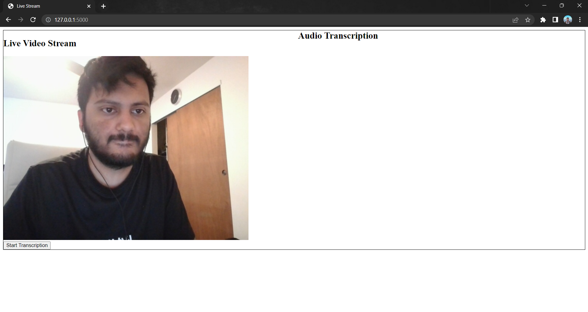
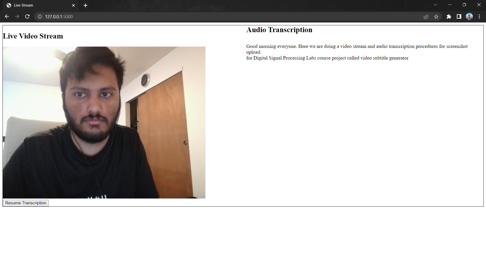
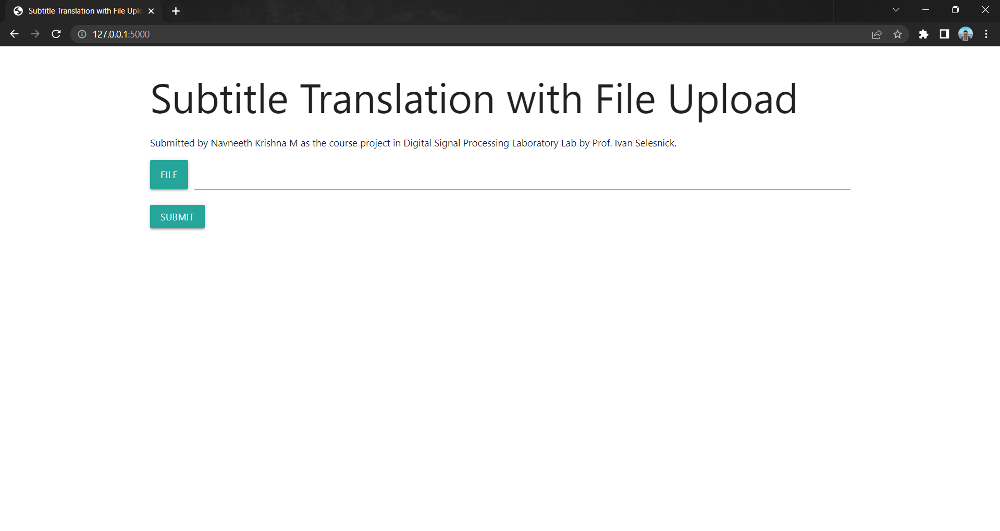
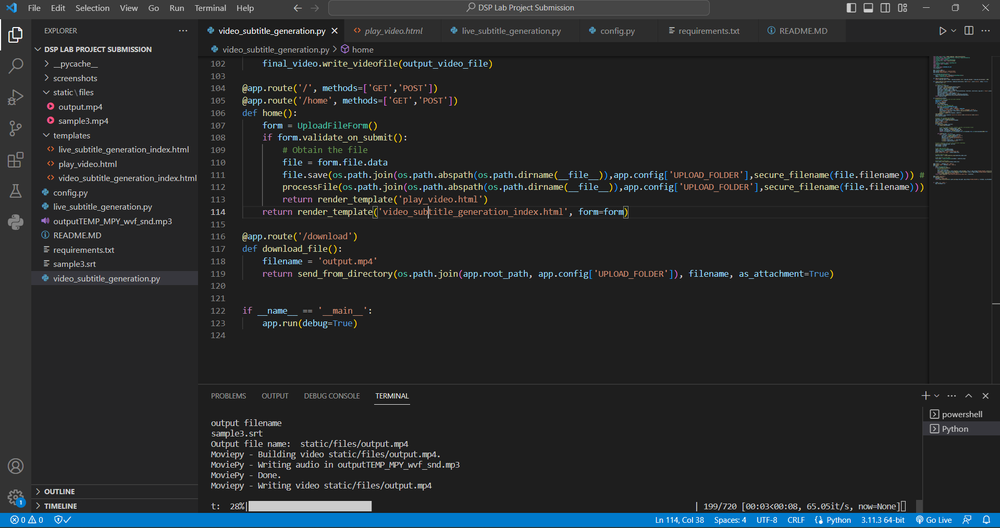
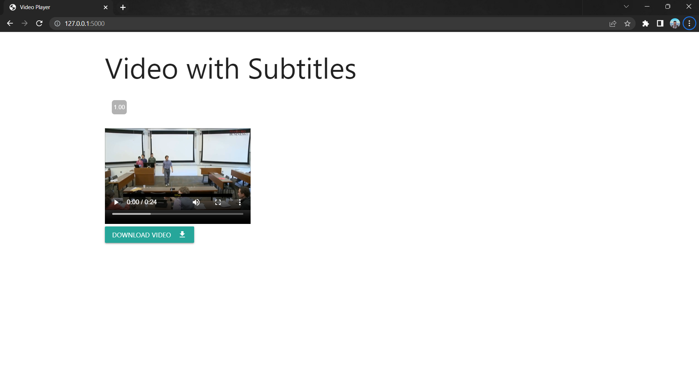
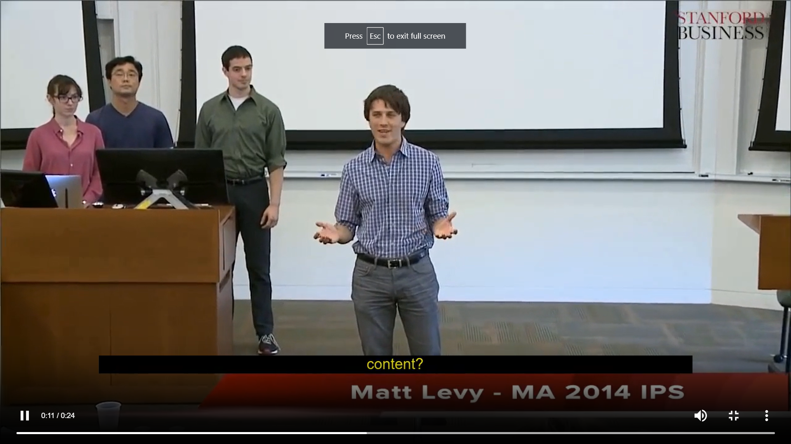

# Documentation for the Video Subtitle Generator project submitted by Navneeth Krishna M for the course DSP Lab, Spring 2023.

The Video Subtitle Generator is a project that combines the capabilities of PyAudio, opencv-python, OpenAI's Whisper API, and Deepgram API to generate subtitles for videos both uploaded and live. 

The project contains two components (expand to view code documentation):

## 1) Live Subtitle Generation
<details> <summary>  This component utilizes video streaming and performs real-time transcription of the input audio using PyAudio, opencv-python, and Whisper API.  </summary>

### Back-end processing

#### Description

This code sets up a Flask web application that performs live audio transcription and video streaming. It captures video frames from the camera and sends them as a multipart response to the `/video` endpoint. It also records audio in chunks, writes the audio to a file, and transcribes it using OpenAI's Whisper API. The transcriptions are stored and can be retrieved using the `/get-transcription` endpoint. The transcription process can be started and stopped using the `/start-transcription` and `/stop-transcription` endpoints respectively.

#### Steps


1. Import the necessary modules and libraries: `Flask`, `render_template`, `Response`, `stream_with_context` from `flask`, `cv2`, `pyaudio`, `wave`, `openai`, and other required modules.

2. Load the OpenAI API key.

3. Set up a Flask application and initialize the camera for video capture.

4. Configure audio recording settings using PyAudio.

5. Define variables for audio transcription, including transcriptions storage, count, and waiting flag.

6. Set up the audio stream for recording.

7. Create an `Event` object to control the transcription thread.

8. Implement the `transcribe_audio` function that continuously records audio and transcribes it using OpenAI's Whisper API.
   - Read audio frames from the stream.
   - Write the audio frames to a WAV file.
   - Start a separate thread to call the `callWhisper` function for transcription.

9. Implement the `callWhisper` function that transcribes the audio file using OpenAI's Whisper API.
   - Open the audio file.
   - Increment the transcription count and obtain a local count.
   - Make a transcription API call using OpenAI's `Audio.transcribe` method.
   - Store the transcription in the `transcriptions` dictionary.

10. Define a route for the index page, which renders the template `live_subtitle_generation_index.html` with an initial empty transcription.

11. Implement the `generate_frames` generator function that continuously captures frames from the camera and yields them in the MJPEG format.
    - Read the camera frame.
    - Encode the frame as a JPEG image.
    - Yield the frame as a multipart response.

12. Define a route for the `/video` endpoint that returns a response with the video frames.

13. Define a route for starting the transcription (`/start-transcription`).
    - If not already waiting, set the `waiting` flag and start the transcription thread.

14. Define a route for stopping the transcription (`/stop-transcription`).
    - Set the stop event to stop the transcription thread.

15. Define a route for retrieving transcriptions (`/get-transcription`).
    - Retrieve the transcriptions and format them as HTML content.

16. Run the Flask application in debug mode.

### Front-end processing

### `live_subtitle_generation_index.html`

#### Description


</details>

## 2) Video Subtitle Generation
<details> <summary> This component utilizes Deepgram API for high-speed audio transcription, the pyrt library to create subtitles, and the moviepy library for adding subtitles. </summary>

### Backend processing 

#### Description 

This code sets up a Flask web application that allows users to upload a video file from the frontend. The uploaded file is processed, transcribed using Deepgram's API, and converted to an SRT subtitle file. The video file is loaded, and subtitle clips are generated and added to the video. Finally, the resulting video with subtitles is served for download.

#### Steps 

1. Import the necessary modules and libraries: `Flask`, `render_template`, `send_from_directory` from `flask`, various classes and functions from other libraries.

2. Set up the Flask application, configure secret key and upload folder.

3. Define a form class (`UploadFileForm`) with a file field and a submit button.

4. Implement a helper function `time_to_seconds` to convert subtitle time to seconds.

5. Implement `create_subtitle_clips` function to generate subtitle clips based on the subtitles provided.

6. Implement `processFile` function that processes the uploaded file:
   - Initialize the Deepgram SDK and perform transcription using the Deepgram API.
   - Extract subtitle data from the transcription response.
   - Convert the subtitle data to the SRT format and write it to a file.
   - Load the video file and SRT file.
   - Create subtitle clips based on the subtitles.
   - Add the subtitle clips to the video.
   - Write the final video file.

7. Define routes:
   - The `/` and `/home` routes handle the main page, allowing users to upload a file. Upon submission, the file is saved, processed using `processFile`, and the user is redirected to a page for playing the video with subtitles.
   - The `/download` route handles the download of the output video file.

8. Run the Flask application.

### Front-end processing

The front-end for this component has 2 parts:

### `video_subtitle_generation_index.html`

#### Description

The video_subtitle_generation_index.html HTML file represents a simple web page that allows users to upload a file using a form. It provides a heading, project information, and a form with a file input field and a submit button. The page utilizes Materialize CSS for styling, including icons and input field components.

#### Steps

1. The HTML document begins with the standard doctype declaration and opening `<html>` tag.

2. The `<head>` section contains metadata and external resource links.
   - Character encoding is set to UTF-8.
   - The X-UA-Compatible meta tag ensures compatibility with Internet Explorer.
   - The viewport meta tag sets the initial scale and width for mobile devices.
   - The page title is set to "Subtitle Translation with File Upload".
   - Material UI styles are imported from Google Fonts and a content delivery network (CDN).

3. The `<body>` section contains the main content of the page.
   - The content is wrapped in a `<div>` element with the class "container" for styling purposes.
   - The `<h1>` element displays the heading "Subtitle Translation with File Upload".
   - A `<p>` element provides additional information about the submission and the course project.
   - A `<form>` element is defined with the method attribute set to "POST" and enctype attribute set to "multipart/form-data".
   - The Flask form is rendered using Jinja2 template tags (`{{form.hidden_tag()}}`, `{{form.file()}}`).
   - The file input field is styled using Materialize CSS classes and components.
   - A submit button is provided with the text "Submit" and appropriate styling classes.

4. The necessary Materialize CSS and JavaScript files are included using CDN links for styling and functionality.

5. The HTML document is closed with the closing `</body>` and `</html>` tags.

### `play_video.html`


#### Description

This HTML file represents a web page that displays a video player with subtitles. It provides a heading, the video player itself, and a download button for the video file. Materialize CSS is used for styling, including icons and button components. The video source is set dynamically using a Flask template tag, and the download button triggers the appropriate Flask route for file download.

#### Steps


1. The HTML document begins with the standard doctype declaration and opening `<html>` tag.

2. The `<head>` section contains metadata and external resource links.
   - Character encoding is set to UTF-8.
   - The X-UA-Compatible meta tag ensures compatibility with Internet Explorer.
   - The viewport meta tag sets the initial scale and width for mobile devices.
   - The page title is set to "Video Player".
   - Material UI styles are imported from Google Fonts and a content delivery network (CDN).

3. The `<body>` section contains the main content of the page.
   - The content is wrapped in a `<div>` element with the class "container" for styling purposes.
   - The `<h1>` element displays the heading "Video with Subtitles".
   - Line breaks (`<br>`) are used for spacing.

4. The HTML5 `<video>` element is used to display the video player.
   - The `id` attribute is set to "video-player".
   - The `width` and `height` attributes specify the dimensions of the video player.
   - The `controls` attribute enables the default video controls.
   - The `<source>` element specifies the source of the video file, which is set using a Flask template tag (`{{ url_for('static', filename='files/output.mp4') }}`).
   - A fallback message is provided for browsers that do not support the video tag.

5. A `<br>` element is used for additional spacing.

6. An anchor `<a>` element is used to create a download link for the video file.
   - The `id` attribute is set to "download-link".
   - The `href` attribute is set using a Flask template tag (`{{ url_for('download_file') }}`), which points to the appropriate Flask route for downloading the video file.
   - The `download` attribute specifies that the file should be downloaded when the link is clicked.

7. Inside the anchor element, a `<button>` element is provided with the text "Download Video" and appropriate styling classes.
   - The `id` attribute is set to "download-button".
   - Materialize CSS classes are used to style the button and include an icon for the file download.

8. The necessary Materialize CSS and JavaScript files are included using CDN links for styling and functionality.

9. The HTML document is closed with the closing `</body>` and `</html>` tags.


</details>


## Setup

### Python libraries
The project is a set of 2 Flask applications that can be run on the localhost after installing the following prerequisites:
``` 
deepgram-sdk
moviepy==2.0.0.dev2
imageio==2.25.1
pysrt==1.1.2
flask
openai
pyaudio
opencv-python
Flask-WTF
WTForms
Werkzeug
```

The above requirements can be installed through the following command:
```
pip install -r requirements.txt
```

### ImageMagick 
The next part of the setup is installing ImageMagick for working on burning subtitles to the video.

We download the binary directly from [here](https://imagemagick.org/script/download.php) and follow steps to install for the respective OS.

### OpenAI
We utilize OpenAI's Whisper API for audio transcription. We use [this link](https://platform.openai.com/account/api-keys) to set up an OpenAI API key upon creating an account if required. 

### Deepgram
We use Deepgram API for faster Speech-To-Text audio transcription. We create an account with Deepgram and set up an API key based on [this resource](https://developers.deepgram.com/documentation/getting-started/authentication/#:~:text=Use%20the%20Deepgram%20Console&text=Locate%20the%20Projects%20dropdown%20on,Create%20a%20New%20API%20Key.).

Once the API keys for OpenAI and Deepgram are created, paste them in the **config.py** file for the respective variables named *OPENAI_API_KEY* and *DEEPGRAM_API_KEY*.

### Running the code

To execute the projects, we use the following commands:

### Live Subtitle Generation
```
python live_subtitle_generation.py
```

### Video Subtitle Generation
```
python video_subtitle_generation.py
```


## Screenshots

### Live Subtitle Generation

<details> <summary> Click to expand </summary>

### Live Video Stream


### Live Subtitle Generation

</details>

### Video Subtitle Generation

<details> <summary> Click to expand </summary>

### Landing Page


### File Uploaded


### Video Server Processing


### Video Output


### Subtitles Burned Into Video


</details>
